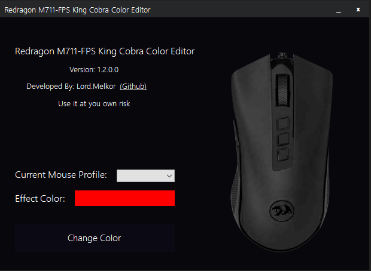
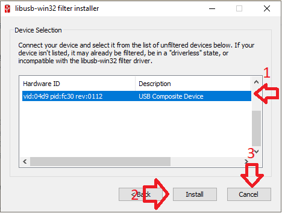

# Redragon RGB Color Editor
Redragon RGB Color Editor based on Redragon Audio Visualizer by D4rkTT (https://github.com/D4rkTT/Redragon-RGB-SDK). The native Redragon software do not work for my King Cobra mouse so i had to improvise :D
All credits to D4rkTT

## Supported Devices
- Redragon M711-FPS King Cobra

## Screenshot

## Download & Install

### Install Driver (First Time Only)
1- Download & Install [LibUsbDotNet](https://sourceforge.net/projects/libusbdotnet/files/latest/download)

2- Install Driver from window that appear after installation Like Screenshot

4- Wait untill done then close it
* You need to install driver again if you changed usb port of mouse

### Download Redragon Audio Viusalizer
1- Download [Latest Release](https://github.com/indy2000/Redragon_KingCobra_RGB/releases/download/release/Redragon.King.Cobra.zip)

2- Open `RedragonVisualizer.exe` then choose color and click `Change Color`

Enjoy ❤
